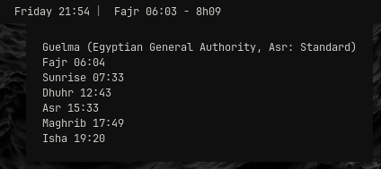
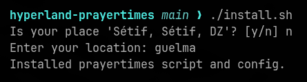

# hyperland-prayertimes


Waybar prayer times module with a countdown, built for Hyprland.

## Features
- Next prayer + countdown in the bar
- Tooltip with all daily times
- Multiple calculation methods
- Configurable offsets and locations


## Screenshots




## Install
From this repo:

```
./install.sh
```

Then reload Waybar:

```
pkill -SIGUSR2 waybar
```

## Usage
List methods (limited to MWL, Egyptian, Makkah):

```
~/.config/waybar/scripts/prayertimes.py --list-methods
```

Switch to a location (auto search if not saved):

```
~/.config/waybar/scripts/prayertimes.py --use-location algiers

Example for commune + city (auto resolves via OpenStreetMap):

~/.config/waybar/scripts/prayertimes.py --use-location draria-algiers
```

Add a new location (and set it active). Coordinates optional:

```
~/.config/waybar/scripts/prayertimes.py --set-location "NewCity" --tz Africa/Algiers
```

Set an offset (minutes):

```
~/.config/waybar/scripts/prayertimes.py --set-offset fajr 2
```

## Config
Edit:

```
~/.config/hyperland-prayertimes/config.json
```

Fields you can customize:
- `location`: active location key
- `locations`: saved locations; lat/lng optional, will auto resolve
- `default_tz`: fallback timezone for auto-resolved locations
- `default_country`: appended for auto-resolve when no country is provided
- `method`: one of the methods listed by `--list-methods` (MWL, Egyptian, Makkah)
- `asr_method`: `Standard` (Maliki/Shafi/Hanbali) or `Hanafi`
- `imsak_minutes`, `dhuhr_minutes`, `maghrib_minutes`, `isha_minutes`
- `adjustments`: per-prayer offsets in minutes
- `display.format`: format with `{next_name}`, `{next_time}`, `{countdown}`

## Notes
- Installer auto-detects location and asks you to confirm or enter it manually.

## Project layout
- `scripts/prayertimes.py`: thin entrypoint for Waybar
- `prayertimes/`: module code (config, geo, calc, rendering, CLI)
- `config/config.json`: default config template


## Contributing

Contributions are welcome.

- Open an issue to discuss changes or bugs.
- Fork the repo and create a feature branch.
- Keep changes focused and update README if behavior changes.
- Test locally (`./install.sh` then `pkill -SIGUSR2 waybar`).
- Submit a PR with a clear description and screenshots if UI changes.

